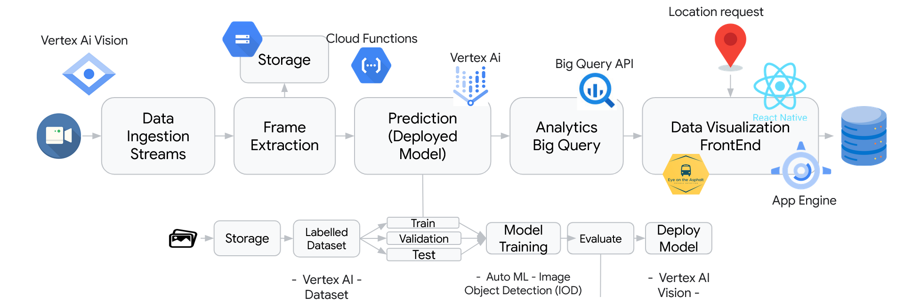

# Eye on the Asphalt

## Table of Contents

1. [Overview](#overview)
2. [Problem Statement](#problem-statement)
3. [The Solution: Eye on the Asphalt](#the-solution)
4. [Solution diagram](#solution-diagram)
5. [Conclusion](#conclusion)
6. [Team members](#team-members)
7. [Acknowledgments](#acknowledgments)
   
## Overview

As part of the Google Cloud Day '24 Lisbon Hackathon, our team participated in the challenge themed "Sustentabilidade - Incidentes na Via Pública". The goal of this challenge was to develop an AI-powered solution to automatically detect and report public incidents using video data captured by public transportation buses. This solution was recognized as the Hackaton winner!

## Problem Statement

Every day, hundreds of public buses operate in the major cities of Portugal. These buses navigate various streets and often encounter incidents such as:
- Accumulation of trash and litter
- Potholes and road surface damage
- Other public nuisances affecting urban sustainability

Currently, reporting these incidents is largely a manual process, which is inefficient and often delayed. Our objective was to create a real-time, automated system to detect and report these incidents, focusing specifically on road potholes.

## The Solution: Eye on the Asphalt

**Eye on the Asphalt** is an innovative system designed to detect road potholes automatically. This solution leverages video data captured by cameras installed on public buses. Utilizing advanced Google Cloud technologies, our system processes these videos in real time, identifies potholes, and reports them accurately.

## Solution diagram

## Benefits

- **Automatization and Efficiency**: Rapid and efficient pothole detection improves urban road maintenance.
- **Precision and Reliability**: High accuracy in identifying potholes, minimizing false positives and negatives.
- **Scalability**: Capable of processing large volumes of data in real time using Google Cloud's robust infrastructure.
- **Urban Sustainability**: Helps maintain well-conditioned public roads, enhancing safety and reducing vehicle damage.

## Conclusion

Our project, Eye on the Asphalt, represents a significant advancement in using AI and cloud technology to foster urban sustainability and create smarter, safer cities.

## Team Members

- andre (mzsv)
- david (davidmonteiro03)
- francisco (Xyckens)
- heitor (HeitorMP)
- joao (jtcat)

## Acknowledgements

-  The 42 School for facilitating our participation in the hackton.
-  Google for the opportunity to take part in the Google Cloud Day Lisbon 2024 hackaton, and the award.
-  Our mentor Joao Catito for the guidance and support.
-  Carris for challenge proposal.
---
